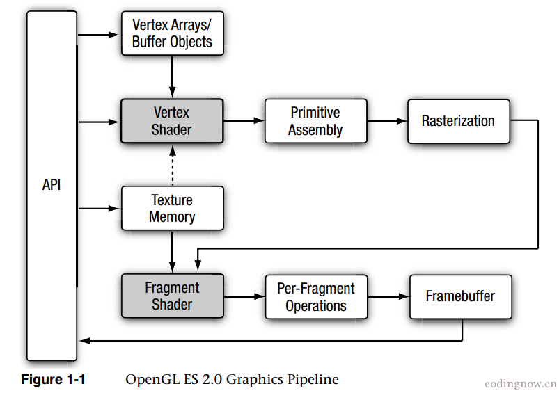
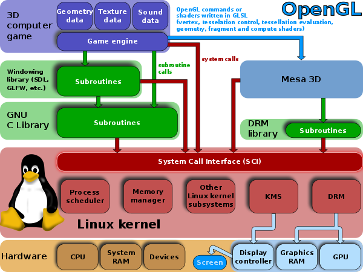

# uCore plus 上 VideoCore IV 显卡驱动的移植与 OpenGL ES 的实现

计54 贾越凯 2015011335

2018 年 5 月 25 日

## 概述

本实验在 uCore plus(ARM) 上进行，使用的硬件为 [Raspberry PI Zero V1.2](https://www.raspberrypi.org/products/raspberry-pi-zero/)，片上系统为 Broadcom BCM2835，包含一块 ARM1176JZF-S CPU 和 VideoCore IV GPU(VC4)，包含两个 Micro USB 接口(电源和数据)，一个 Mini HDMI 接口，可以使用串口进行通信。

实验的原目标如下：在真实硬件环境中，让 uCore 支持轻量级图形界面的显示，并尽可能提高性能。

1. 将 Nuklear GUI 库移植到 uCore plus 并跑在 Raspberry Pi 上，通过 HDMI 接口显示画面。

2. 支持 Raspberry PI 自带 GPU VideoCore IV 的 2D 硬件加速。

3. 可能的扩展：
    + 将 Nuklear GUI 库移植到 x86 等多种平台。
    + 支持 VideoCore IV GPU 的 3D 硬件加速。

在 2018 年 5 月 4 日，实验取得了重大突破，能够根据文档控制 VC4 GPU 绘图了，而且有完成的参考代码(Linux 和 Mesa3D)，可以进一步实现 OpenGL ES 的部分功能。实现一个通用的 3D 图形库远比移植一个简陋的 2D GUI 系统意义大，于是决定不移植 GUI 库，新的目标为：

1. 在 uCore plus 上实现 VideoCore IV 的驱动；
2. 使用该驱动实现 OpenGL ES 的部分功能，并封装成图形库(GL)供应用程序调用。

## 相关工作

### uCore plus on Raspberry Pi

2012 年，[金昊衠][jhz12]同学首次在 Raspberry Pi 上运行了 uCore plus，同时使用串口和 HDMI 分别作为 Raspberry Pi 的终端输入、输出。该工作已并入 uCore plus 主分支，但是原来最新版的 uCore plus 无法启动。

2012 年，[陈宇恒和杨扬][cyh12]同学将 uCore plus 移植到了 Android Goldfish 模拟器上(ARMv7)，并设计了 DDE 层(Driver Device Envrionment)，重用了 Linux 的 Framebuffer、触摸屏输入等驱动。并在此基础上，移植了 uClibc(c 运行库) 和 MiniGUI (GUI 系统)。

2014 年，[常铖和叶紫][cc14]同学尝试在 Raspberry Pi 上重用 Linux 的 framebuffer 等驱动，但是没有多大进展。不过该工作修复了最新版的 uCore plus 无法启动的问题。

[cyh12]:http://os.cs.tsinghua.edu.cn/oscourse/OsTrain2012/DDE
[jhz12]:http://os.cs.tsinghua.edu.cn/oscourse/OsTrain2012/Raspberry
[cc14]:http://os.cs.tsinghua.edu.cn/oscourse/OS2014/projects/RaspberryPi
[commit2e1a50]: https://github.com/chyyuu/ucore_os_plus/commit/2e1a50f0165fa7e8a261d2c9cbefb13bf423aa49
[vc4doc]:https://docs.broadcom.com/docs-and-downloads/docs/support/videocore/VideoCoreIV-AG100-R.pdf

### VideoCore IV 驱动

VideoCore IV(下称 VC4) 是 Broadcom 公司的一款低功耗移动多媒体处理器，被 Raspberry PI 0,1,2,3 所使用，完全支持 OpenGL ES 2.0 和 OpenVG 1.1。由于 Raspberry PI 的流行，许多人对 VC4 的驱动感兴趣，但是当时并没有关于 VC4 的任何源码或文档。

在没有开源驱动时，要想使用 VC4 的功能，只能使用 Broadcom 提供的封闭的二进制 BLOB，其功能有限，而且不易于移植。不过近几年来，VC4 的开源工作进展顺利：

* 2014 年 2 月 28 日，Broadcom 公布了 VideoCore IV 图形处理器的[完整文档][vc4doc]。

* 2014 年 8 月，Broadcom 雇用 Eric Anholt 为 VC4 开发基于 Mesa3D 的免费开源图形驱动，并首次在发布在 Mesa 10.3 中。

* 2015 年，Eric Anholt 又为 Linux 内核编写了 VC4 DRM 驱动，并被合并进 Linux 4.1 内核中。

* 2016 年 1 月，Raspberry Pi 官方发布 Raspbian Scratch 操作系统，其中包含了 Eric Anholt 编写的开源 VC4 驱动。

## 具体实现

### 移植之前

在动手移植 GPU 之前，目前最新的 [uCore plus](https://github.com/chyyuu/ucore_os_plus) 或存在一些 bug，或缺少一些必要的功能，所以还需要做一些准备工作。

#### 修复最新版 uCore plus 无法启动的问题

自从 2012 年[金昊衠的工作][jhz12]成功将 uCore plus 在 Raspberry PI 上跑起来后，uCore plus(ARM) 又经历过几次修改。在 [commit 2e1a50][commit2e1a50] 之后已经无法在 Raspberry PI 上启动。

[commit 2e1a50][commit2e1a50] 主要做了如下修改：

* 将 ARM 架构的物理内存映射地址(`KERNBASE`)从 `0x0` 改为了`0xc0000000`，内核起始地址(`TEXT_START`)改为了 `0xc0008000`；

* 在内核初始化前(`entry.S` 中)创建了临时页表；

* 增加了 uboot 作为 ARM 架构的默认 bootloader。

但是，这些修改只针对 `BOARD=goldfishv7`，在 Raspberry PI 上并不能运行，uboot 无法启动 uCore plus。

[常铖等人的前期工作][cc14] 使得最新的 uCore plus 能够在 Raspberry PI 上跑起来，主要修改如下：

* 将 `BOARD=raspberrypi` 的 `KERNBASE` 改为了 `0xc0000000`，`TEXT_START` 改为了 `0xc0010000`；

* 对 bootloader 也做了相应的修改，使得能够从修改后的链接地址正常加载内核。但是该 bootloader 的代码并未合并入 uCore plus 的任何分支。

此外，frameBuffer 已无法使用，`fb_init()` 函数会导致崩溃。

我的修改主要如下：
* 在 `Kconfig` 中加入 `KERNEL_BASE` 和 `TEXT_START` 的设置，使得同一 `ARCH` 下不同的 `BOARD` 可以使用不同的 `KERNEL_BASE` 和 `TEXT_START`。对于 `BOARD=raspberrypi`，`KERNBASE=0xc0000000`，`TEXT_START=0xc0800000`(之前用的一直是 `0xc0010000`，但是 2018 年 5 月 17 日发现在该设置下，bootloader 加载内核时多个 `proghdr` 可能会相互覆盖，所以改为了 `0xc0800000` 确保偏移量大于内核大小)。

* 修复启用 framebuffer 会导致崩溃的问题：使用 mailbox 获取 framebuffer 时，传入的 buffer 地址没有 16 字节对齐；`fb_write()` 函数可能会直接访问未经映射的 `screenbase`。不过之后的 framebuffer 和 mailbox 架构已经发生了巨大改变。

* 将 `ucore/src/bootloader/arch/arm/` 目录中的 bootloader 作为 `BOARD=raspberrypi` 时的 bootloader，并将串口初始化的代码移入内核而不是 bootloader 中完成。现在对于 `BOARD=raspberrypi` 已经不需要外部 bootloader 了。

#### Mailbox 的完善

[Mailbox](https://github.com/raspberrypi/firmware/wiki/Mailboxes) 是 Raspberry PI 上 ARM CPU 与 VC4 GPU 之间通信的渠道。[金昊衠的工作][jhz12] 就是通过 mailbox 获取 framebuffer 的大小、基址等信息的。不过他的实现非常简单，不易于扩展为其他 mailbox 操作。

Mailbox 可认为是一段按特定格式存储的请求指令，包含请求代码、请求长度、请求参数等信息。通过向特定几个的 IO 地址(`0x2000b880` 等)写入存放请求的内存地址，通过轮询等待，就会在收到响应，响应的内容存放在之前存放请求的内存中。

Raspberry PI mailbox 提供的接口包括 framebuffer interface 和 property interface 等，在我修改的 uCore plus 中使用的是 property interface，请求的具体格式可以在[这里](https://github.com/raspberrypi/firmware/wiki/Mailbox-property-interface)找到。通过 property interface，可以进行获取和设置 framebuffer 信息、显存分配与释放、启用 QPU、运行 QPU 程序等操作。

在我修改的 uCore plus 中，对 Raspberry PI mailbox 的操作位于 `KERN_SRC_ARM/mach-raspberrypi/mailbox.c` 和 `KERN_SRC_ARM/mach-raspberrypi/mailbox_property.c` 中。其中 `mailbox.c` 实现了对 mailbox IO 地址的读写操作，`mailbox_property.c` 封装了通过 mailbox 实现的一些访问 VC4 的操作。实现方案参考了 [Linux](https://github.com/torvalds/linux/blob/master/drivers/firmware/raspberrypi.c)，具有可扩展性，可在此基础上方便地实现更多 mailbox 操作。

#### 实现 framebuffer 驱动

[金昊衠的工作][jhz12] 首次通过 Raspberry PI 的 framebuffer 向屏幕中输出字符。不过该 framebuffer 的实现非常简单，只能在内核态对其进行访问。[陈宇恒等人的工作][cyh12] 将 Linux framebuffer 驱动直接移植到了 Android Goldfish 模拟器上，保留了 Linux 的系统调用接口，可以在用户态通过 `open("fb0:")`、`ioctl` 和 `mmap`(uCore plus 中为 `sys_linux_mmap()`) 系统调用对其进行访问，在 `ucore/src/user-ucore/tests/arch/arm/hello.c` 中还有个基于 framebuffer 实现的简单动画。

该阶段我的目标就是在 uCore plus 中实现比较完整的 Raspberry PI framebuffer 驱动，使得用户态程序也可以通过 `ioctl` 和 `mmap` 访问 Raspberry PI 的 framebuffer。曾经尝试过将 DDE 移植到 `BOARD=raspberrypi` 上，这样可以重用 Linux 的驱动代码，但是经过简单移植后在初始化设备时发生崩溃，不想在此耽误太多时间，就决定在 uCore plus VFS 设备文件的框架下实现。

##### 获取 framebuffer 信息

金昊衠已经实现了该功能，我使用新的 mailbox property interface，并参考 [Linux](https://github.com/raspberrypi/linux/blob/rpi-4.16.y/drivers/video/fbdev/bcm2708_fb.c) 对其进行了重构。

需要注意的是，在得到 fb 的基址后不能立即使用，需要通过 `__ucore_ioremap()` 函数在页表中映射后才能使用。IO 内存基址经过映射后会变为 `UCORE_IOREMAP_BASE(0xEF000000)` 以上的虚拟地址。但是该函数的实现不易于取消映射，所以 fb 基址一旦被映射后就一直存在于页表中。实现 VC4 驱动时对 BO 的映射没有采用这种方式。

##### 作为 VFS 设备

只需对 uCore plus 进行如下修改即能将 fb 作为 VFS 设备：

* 在 `ucore/src/kern-ucore/arch/arm/mach-raspberrypi/board.c` 中，增加设备初始化函数 `device_init()`，该函数在 `init.c` 中被调用，并调用 `dev_init_fb()` 初始化 fb 设备。

* 在 `ucore/src/kern-ucore/arch/arm/mach-raspberrypi/bcm2708_fb.c` 中实现 fb 设备的驱动(参考 `ucore/src/kern-ucore/fs/devs/` 目录中的各设备)，包括 `dev_init_fb()` 函数，会调用 `dev_create_inode()` 创建设备 `inode`，绑定 `open()`、`close()`、`ioctl()` 等操作；`bcm2708_fb_probe()` 函数使用 mailbox property interface 获取 fb 信息，初始化 `fb_info` 结构体。

##### ioctl 的实现

对于 `ioctl`，在没有 DDE 时并不可使用，需要添加进 FS 中。具体修改如下：

* 在 `ucore/src/kern-ucore/fs/sysfile.c` 的 `sysfile_ioctl()` 函数中调用 `file_ioctl()`；
* 在 `ucore/src/kern-ucore/fs/file.c` 中实现 `file_ioctl()` 函数，调用 `dev->d_ioctl()`；
* 在 `ucore/src/kern-ucore/arch/arm/mach-raspberrypi/bcm2708_fb.c` 中，绑定 `dev->d_ioctl()` 为具体的实现。

目前实现的对 fb 的 `ioctl` 操作如下表所示：

|          `cmd`          |                操作                 |
|-------------------------|-----------------------------------|
|  `FBIOGET_VSCREENINFO`  |  获取 fb 的 `fb_var_screeninfo` 结构体  |
|  `FBIOGET_FSCREENINFO`  |  获取 fb 的 `fb_fix_screeninfo` 结构体  |
|    `FBIOPAN_DISPLAY`    |  设置横、纵坐标上的偏移量(用于实现双缓冲区)       |

其中 `fb_var_screeninfo`、`fb_fix_screeninfo` 的定义与 Linux 相同，详见 `ucore/src/kern-ucore/libs/fb.h`。

##### mmap 的实现

`mmap` 的实现与 `ioctl` 类似，也是在 `sysfile.c` 和 `file.c` 中做相应的修改，并在 `bcm2708_fb.c` 中进行绑定和具体实现。需要注意的是，这里的 `mmap` 是向设备中申请一段内存的映射，需要传入 `fd`，不同于 uCore plus 中已实现的内存的直接映射，所以用户态函数应为 `sys_linux_mmap()`。

此外，在进行物理地址到用户虚拟地址的映射时，需要修改页表项。但是该物理地址不同于普通的物理地址，它可能不在可用页的范围内(`pa2page` 时不符合 `PPN(pa) < npage`)，即不存在 `Page` 结构，不能通过 `page_insert()` 将物理地址转换为对应的 `Page`，取消映射时也是如此。目前的解决方法是：

* 在 `ucore/src/kern-ucore/mm/vmm.c` 中，新增了 `remap_pfn_range()` 专门用于映射此类地址，通过直接修改每一页用 `get_pte()` 得到的页表项完成映射，并将用户的 `vma_struct` 中的 `vm_flags` 设为 `VM_IO`；
* 取消 `vma_struct` 中内存映射时，调用新增的 `unmap_vma_range()` 函数，会判断 `vm_flags` 是否是 `VM_IO`，如果是就直接将每一页用 `get_pte()` 得到的页表项清空，否则直接调用 `unmap_range`。

### VC4 驱动的移植

自从 2014 Boardcom 发布 VC4 完整文档以来，关于 VC4 开源驱动的工作进展迅速。最早出现的是一个叫 [hackdriver](https://github.com/phire/hackdriver) 的 300 行用户态程序，它使用 `mmap` 使得能够在用户态访问 V3D IO 地址和显存地址，将内存中的一段区域作为 framebuffer 进行绘制，并将渲染的结果(一个彩色三角形) dump 到文件中。

此后，Eric Anholt 一直在为 Linux 和 Mesa 编写 VC4 开源驱动，他最早也是参考了 hackdriver 的代码，Mesa 当年的 commit 记录中还保留有 hackdriver 代码的影子。如今，该开源驱动已经实现得非常完善了。

#### VC4 渲染管线简介

VC4 完整支持 OpenGL ES 2.0，其图形管线是可编程的，可分为下面几个阶段：

1. 顶点着色器
2. 图元装配
3. 光栅化
4. 片段着色器
5. 逐片段操作(裁剪测试、模板测试、深度测试、颜色混合等)



其中阴影部分的着色器是可编程的，用户可以指定顶点着色器程序和片段着色器程序，其中顶点着色器用于计算顶点的屏幕左边、颜色，片段着色器用于计算屏幕上像素点的颜色。

#### Control Lists

对 VC4 的渲染命令通过 Control Lists(CL) 实现。CL 是一段保存有控制数据并按一定格式组织的连续内存，存放于 GPU 中。CL 中存放的数据包括命令编号、命令参数、顶点数据、另一个 CL 的地址等。

最主要的 CL 有两个，分别为 Binning Control List(BCL) 和 Render Control List(RCL)，它们的用途如下：

* BCL：存放一次绘图操作的各种参数，如绘制区域大小、顶点数据地址、顶点编号数组地址、着色器程序地址等。
* RCL：存放最终的绘制指令。VC4 会把 framebuffer 分为若干个的小块(一般是 64x64)，称为 "tile"，RCL 要做的是将这些小块串联起来，让 GPU 依次在这些小块上进行绘制。

另一个重要的 CL 是 Shader State Record，被 BCL 中的 Shader State 指定，用于存放着色器信息、顶点和顶点属性的地址等。

当构建完 BCL 和 RCL 后，将其头地址写入特定的寄存器(被称为 V3D 寄存器，是从 `0x20c00000` 开始的若干个 IO 地址)，即可完成一次绘制。

#### 着色器

VC4 中有 3 种着色器，分别为顶点着色器(Vertex Shader)、坐标着色器(Coordinates Shader)、片段着色器(Fragment Shader)。标准 OpenGL ES 2.0 中的顶点着色器在 VC4 中会被拆分为顶点着色器和坐标着色器，以提高流水线效率。

VC4 的着色器处理器被称为 QPU(Quad Processor Unit)，一种 SIMD 处理器，一块 VC4 GPU 上拥有 16 个 QPU。应用程序一般会把着色器程序写为 GLSL(OpenGL Shading Language) 语言，然后在程序运行时动态编译，生成 QPU 的指令。

标准的 OpenGL ES 2.0 必须指定着色器才能绘制，VC4 也是如此，必须在 BCL 中指定 Shader State 来设置着色器。Shader State 分三种，GL Shader State、NV Shader State 和 VG Shader State，每种都对应不同的 Shader State Record 格式。其中在 GL Shader State Record 中必须给出全部三种着色器程序的地址；而 NV(no vertex) Shader State Record 认为它的顶点数据都是已经被顶点着色器处理过的了，所有只需指定片段着色器；VG Shader State 用于 Open VG，也只需指定片段着色器，

#### Linux + Mesa 框架中的实现

Liunx 中对 GPU 的管理是通过 DRM(Direct Rendering Manager) 子系统进行的。DRM 是为了让多个程序同时使用 GPU 而设计的，当多个程序试图同时访问 GPU 资源时，DRM 会进行仲裁以避免冲突。用户程序与 DRM 的通信可以通过 `ioctl` 进行的。

Mesa3D 是开源的 OpenGL (ES) 实现，它将 OpenGL 函数翻译为 GPU 命令，通过 `ioctl` 传给 DRM 来完成绘制。所以，对于一种 GPU，其驱动分为两部分：运行在用户态的 Mesa 驱动以及运行在内核态的 DRM 驱动。



对于 VC4 GPU，这两部分开源驱动的实现得益于 Eric Anholt 的工作，它们的源码分别位于 [这里](https://github.com/raspberrypi/linux/tree/rpi-4.14.y/drivers/gpu/drm/vc4) 和 [这里](https://github.com/mesa3d/mesa/tree/master/src/gallium/drivers/vc4)。通过深入阅读这两部分的源码，并结合 [Linux 官方文档](https://dri.freedesktop.org/docs/drm/gpu/vc4.html)，可总结出在 Linux + Mesa + VC4 图形架构下一条 OpenGL 绘图命令的执行流程如下：

1. Mesa 前端创建绘图时的上下文(Context)，识别 OpenGL 命令，转化为 Mesa 内部的统一操作，并更新上下文的内容；
2. Mesa 后端(VC4 驱动部分)根据统一的绘图操作，在用户态内存中构造 BCL。BCL 中可能需要填入某段显存块(Buffer Object, BO)的物理地址，这在用户态是不知道的，Mesa 就把 BCL 中相应的位置空出来，并在 BCL 的其他地方中填入 BO 的标识符(handle)；
3. 使用 `ioctl` 系统调用将 BCL 传给 Linux DRM；
4. Linux DRM(VC4 驱动部分) 会验证 BCL 的合法性，对 BO 标识符进行重定位，填入 BO 的物理地址，并将已验证过的 BCL 放入 GPU 显存。
5. Linux DRM 在内核态生成 RCL，并放入 GPU 显存。
6. 向 V3D 寄存器写入 BCL 和 RCL 的显存起始地址，完成绘制。

#### 在 uCore plus 中的实现

要想再 uCore plus 中实现 VC4 驱动，也需要实现内核态和用户态两部分。对于内核态，uCore plus 没有 DRM 子系统，而 Linux 中的 VC4 驱动又严重依赖于 DRM；对于用户态，Mesa 中的 VC4 驱动也严重依赖于 Mesa 中的其他模块，而 Mesa 又非常庞大，代码量甚至超过了 uCore plus 本身。所以两部分驱动都不能直接照搬过来。不过，VC4 驱动本身是还比较小的，其[文档][vc4doc]只有 100 多页，那个能画三角形的 [hackdriver](https://github.com/phire/hackdriver) 也只有 300 多行，所以比较明智的做法是，从头开始写 uCore plus 的 VC4 驱动，绕过 DRM 和 Mesa 的依赖，但尽可能保持和 Linux 与 Mesa 驱动相同的命名与接口，以便能够复用相关代码。

##### 内核态部分

内核态驱动位于 `KERN_SRC_ARM/mach-raspberrypi/vc4/` 目录下，包含下列文件：

```
vc4
├── vc4_bo.c
├── vc4_cl.c
├── vc4_cl.h
├── vc4_drm.h
├── vc4_drv.h
├── vc4_drv.c
├── vc4_gem.c
├── vc4_packet.h
├── vc4_regs.h
├── vc4_render_cl.c
└── vc4_validate.c
```

各文件的具体说明如下：

* `vc4_bo.c`：BO 即 Buffer Object, 表示一段连续的显存。该文件实现了对 BO 的各种操作，如创建、释放、查找、映射给用户空间等。

* `vc4_cl.[ch]`：实现了对 CL 的各种操作。由于内核态只生成 RCL，且不需要重定位，所以该文件的实现比用户态同名文件的实现要简单。

* `vc4_drm.h`：从 [Linux](https://github.com/torvalds/linux/blob/master/include/uapi/drm/vc4_drm.h) 中复制了部分代码，定义了 `ioctl` 可用的功能、用户态驱动通过 `ioctl` 传给内核态的数据的格式。

* `vc4_drv.[ch]`：将 VC4 也作为了 VFS 设备，该文件包含了设备初始化、`ioctl` 的实现。

* `vc4_gem.c`：GEM 即 Graphics Execution Manager，用于在 GPU 上运行命令。内核驱动收到用户驱动发来的数据后，构造了一个 `vc4_exec_info` 结构，然后分别调用 `vc4_get_bcl()` 和 `vc4_get_rcl()`，将已验证的 BCL 写入显存，并生成 RCL。最后调用 `vc4_queue_submit()` 向 GPU 提交两个 CL 的地址。

* `vc4_packet.h`：定义了 BCL 和 RCL 命令的编号、格式，直接从 [Linux](https://github.com/torvalds/linux/blob/master/drivers/gpu/drm/vc4/vc4_packet.h) 中复制。

* `vc4_regs.h`：定义了 V3D 寄存器的 IO 地址，直接从 [Linux](https://github.com/torvalds/linux/blob/master/drivers/gpu/drm/vc4/vc4_regs.h) 中复制。

* `vc4_render_cl.c`：实现了 RCL 的生成。

* `vc4_validate.c`：实现了对 BCL 和 Shader State Records 的验证，以及 BO 地址的重定位。

##### 用户态部分

用户态驱动位于 `ucore/src/lib-user-ucore/libgl/src/drivers/vc4` 目录下，包含下列文件：

```
vc4
├── vc4_bufmgr.c
├── vc4_bufmgr.h
├── vc4_cl.c
├── vc4_cl.h
├── vc4_context.c
├── vc4_context.h
├── vc4_draw.c
├── vc4_drm.h
├── vc4_emit.c
├── vc4_packet.h
├── vc4_program.c
├── vc4_resource.c
├── vc4_resource.h
└── vc4_state.c
```

各文件的具体说明如下：

* `vc4_bufmgr.[ch]`：定义了用户态的 BO，与内核态中的一一对应。在该文件实现了用户态对 BO 的分配、释放、映射。

* `vc4_cl.[ch]`：与内核驱动中的类似，只是用户态加入了对 BO 重定位、动态调整 CL 大小的支持。

* `vc4_context.[ch]`：`vc4_context` 结构体定义了当前执行绘制时的上下文信息，这些信息可能会在本次绘制结束后立即重置，或保留给下一次绘制。该文件中还实现了 `vc4_flush()`，将当前的 BCL、Shader State Records 以及其他上下文信息保存到 `drm_vc4_submit_cl` 结构，提交给内核。

* `vc4_draw.c`：实现了绘图操作 `vc4_draw_vbo()` 和清屏操作 `vc4_clear()`。调用它们时，会将根据当前的上下文信息生成 BCL。不过为了提高效率，执行完成后不会马上提交给内核，必须调用 `vc4_flush()` 才会提交。

* `vc4_drm.h`：与内核驱动中的一样。

* `vc4_emit.c`：与 Mesa 中的同名文件功能类似，用于在 BCL 中加入些状态信息。

* `vc4_packet.h`：与内核驱动中的一样。

* `vc4_program.c`：定义了一段硬编码的片段着色器，并将该着色器构造为 BO。由于当前只使用 NV Shader State，所以不需要顶点着色器和坐标着色器。

* `vc4_resource.[ch]`：为 GL(Graphics Library) 实现的分配和释放 BO 的统一接口。

* `vc4_state.c`：实现了 RCL 的生成。

#### 实现细节

##### BO 的创建与释放

显存的分配与释放需要使用 mailbox property interface，可分别调用 `mbox_mem_alloc()` 和 `mbox_mem_free()` 完成。需要注意的是，在分配显存后不能直接使用，要调用 `mbox_mem_lock()` 将其锁定后再使用，并在释放前调用 `mbox_mem_unlock()` 解锁。`mbox_mem_alloc()` 会返回一个 `handle`，即显存标识符，而实际的物理地址是由 `mbox_mem_lock()` 返回的。

分配好一段显存后，其地址不在页表中，需要在页表中建立映射。为了方便，直接让虚拟地址等于物理地址，调用 `__boot_map_iomem()` 即可完成映射。注意这里不应使用 `__ucore_ioremap()`，使用该函数映射的地址不易取消映射，且地址空间较小。

当要释放一段显存时，先调用 `__ucore_iounmap()` 取消映射，再依次进行解锁显存、释放显存。

##### ioctl 接口

在 VC4 的内核驱动部分，仿照 DRM 实现了几个 `ioctl` 操作，如下表所示：

|          `cmd`              |                操作                 |
|-----------------------------|-------------------------------------|
|  `DRM_IOCTL_VC4_SUBMIT_CL`  |  向内核提交 `drm_vc4_submit_cl` 结构体  |
|  `DRM_IOCTL_VC4_CREATE_BO`  |  申请创建一块 BO  |
|  `DRM_IOCTL_VC4_MMAP_BO`    |  申请将一块 BO 的物理地址映射为用户空间地址       |
|  `DRM_IOCTL_VC4_FREE_BO`    |  申请释放一块 BO       |


##### BO 重定位

当用户态生成 BCL 时，BCL 中有些地方需要填入 BO 的物理地址，但此时无法得知，而将 BO 的物理地址暴露给用户态也不是很好。

参考 Linux，实现了一种重定位机制：当 CL 的某条命令需要填入 $n$ 个 BO 物理地址时，额外给 CL 分配 $4n$ 字节的空间，在这些位置写入 BO 的 序号，原位置写入偏移。提交时，同时给出本次提交引用到的 BO 的 `handle` 列表(`submit.bo_handles`)。然后在 `vc4_gem.c` 中，根据 `bo_handles` 恢复出本次提交引用到的 BO 在内核态的对应者，在验证 BCL 和 Shader State Records 时再根据重定位信息，填入实际 BO 的物理地址。

为了能够在内核态高效查找一个 `handle` 对应的 BO，仿照 uCore plus 中的文件系统，假设同时使用的 BO 数较少，于是直接在内存中分配了固定大小个 BO 对象，起始地址为 `vc4->handle_bo_map`。一个 `handle` 对应的 BO 即 `vc4->handle_bo_map[handle]`。实验表明，当一个 BO 被释放后，其 `handle` 也会被回收，可能被下一个分配的 BO 所使用。所以也不必担心 `handle` 编号过大的问题。

##### BO 的生命周期管理

在一次绘图命令执行的过程中，可能会创建 BO，也可能会使用之前创建的 BO。何时对这些 BO 进行资源释放是个需要考虑的问题。

将 VC4 中使用的 BO 按生命周期分，大致可分为如下四类：

1. 设备初始化时就创建的显存，被所有的绘图程序和命令共享，如 BCL Tile Binning Mode Configuration 中的 Tile Allocation Memory 和 Tile State Data Array。这类 BO 可不必释放。

2. 应用程序启动时创建的显存，被当前程序的所有的绘图命令共享，如着色器、统一变量的显存。这类 BO 可在程序运行结束时统一回收。

3. 一次提交时由内核创建的显存，在该次提交绘制完成后就不被使用，如 BCL、RCL 所用的显存。这类 BO 可在创建后用链表组织起来，绘图完成时遍历链表，统一释放。

4. 执行一次绘图命令时又用户态创建的显存，需要一直保留到该命令被提交，如 `glDrawElements` 指定的顶点编号。对这类 BO 我使用引用计数的方式管理：在 BO 被创建时初始化引用计数为 1，一次提交结束后将所有用到的 BO 的引用计数减 1，当引用计数减为 0 时自动释放 BO。

### OpenGL ES 的实现

实现了 VC4 的内核态和用户态驱动后，可在此基础上实现 OpenGL ES 的部分功能，进而可以实现一个图形库(GL)。由于要支持 OpenGL ES 2.0 的着色器需要先实现 GLSL 编译器，所以暂时只实现了 OpenGL ES 1.1 的。

下表是目前我已实现的 OpenGL ES 1.1 函数：

| OpenGL ES 1.1 函数        | 功能 |
|--------------------------|----------------------|
| `glViewport()`           | 设置视口              |
| `glClearColor()`         | 设置清屏时的颜色        |
| `glClearDepthf()`        | 设置清除深度缓冲时的深度 |
| `glClearStencil()`       | 设置清除模板缓冲时的值   |
| `glClear()`              | 使用设定的值清除屏幕/深度缓冲区/模板缓冲区 |
| `glGetError()`           | 获得上一次运行错误时的错误信息 |
| `glVertexPointer()`      | 指定顶点               |
| `glDrawArrays()`         | 绘制 `glVertexPointer()` 指定的连续顶点         |
| `glDrawElements()`       | 使用给定顶点编号绘制 `glVertexPointer()` 指定的顶点  |
| `glEnableClientState()`  | 启用绘制点/绘制颜色       |
| `glDisableClientState()` | 禁用绘制点/绘制颜色       |
| `glColor4f()`            | 设置当前颜色             |
| `glColorPointer()`       | 指定顶点颜色             |

下列 3D 变换函数使用 CPU 实现，且还处于测试阶段，未合并入主分支：

| OpenGL ES 1.1 函数  | 功能 |
|--------------------|-------------------------|
| `glLoadIdentity()` | 设置当前矩阵为单位矩阵      |
| `glMultMatrixf()`  | 将当前矩阵右乘上给定矩阵     |
| `glTranslatef()`   | 将当前矩阵右乘上平移矩阵     |
| `glFrustumf()`     | 将当前矩阵右乘上透视矩阵     |

#### 图形库的实现

我实现的 GL 位于 `ucore/src/lib-user-ucore/libgl/` 目录下，其目录结构如下：

```
libgl
├── include
│   ├── EGL
│   │   └── egl.h
│   ├── GLES
│   │   └── gl.h
│   └── ...
└── src
    ├── drivers
    │   └── vc4
    ├── pipe
    │   ├── p_context.h
    │   ├── p_defines.h
    │   └── p_state.h
    ├── egl.c
    └── gl.c
```

其中 `include` 子目录存放可被用户程序 include 的头文件，`src` 里是具体实现，`src/drivers/vc4/` 即 VC4 的用户态驱动；`src/gl.c` 中是 OpenGL ES 函数的实现；`src/egl.c` 中是模仿 EGL API 实现的 GL 辅助函数；`src/pipe/` 中定义了 GL 所使用的上下文信息。

这些文件可编译生成静态链接库 `libgl.a`。用户程序只需 `#include <GLES/gl.h>`，然后在编译时链接该静态库，即可使用 GL 库。

一个用户程序的例子如下：

```c
#include <EGL/egl.h>
#include <GLES/gl.h>

EGLDisplay dpy;
EGLDisplay ctx;

static GLfloat vertexs[] = {
	-0.5, -0.5,
	0.5, -0.5,
	0, 0.5,

	0, -0.3,
	0.6, -0.3,
	0.3, 0.6
};

static GLfloat colors[] = {
	1, 0, 0, 1,
	0, 1, 0, 1,
	0, 0, 1, 1,

	0, 0, 1, 1,
	0, 1, 0, 1,
	1, 0, 0, 1,
};

void init()
{
	glClearColor(0.64f, 0.81f, 0.38f, 1.0f);
}

GLfloat u = 0.01, v = 0.01;

void draw()
{
	int i;
	for (i = 0; i < 12; i += 2) {
		vertexs[i] += u;
		vertexs[i + 1] += v;
	}

	glClear(GL_COLOR_BUFFER_BIT);

	glVertexPointer(2, GL_FLOAT, 0, vertexs);
	glColorPointer(4, GL_FLOAT, 0, colors);

	glEnableClientState(GL_VERTEX_ARRAY);

	glColor4f(1, 0.5, 0, 1);
	glViewport(0, 0, 960, 540);
	glDrawArrays(GL_TRIANGLES, 0, 3);

	glEnableClientState(GL_COLOR_ARRAY);

	glViewport(960, 540, 960, 540);
	glDrawArrays(GL_TRIANGLES, 3, 3);

	glDisableClientState(GL_COLOR_ARRAY);
	glDisableClientState(GL_VERTEX_ARRAY);

	glFlush();

	eglSwapBuffers(dpy, ctx);
}

int main(int argc, char *argv[])
{
	cprintf("Hello GLES!!!\n");

	dpy = eglGetDisplay(EGL_DEFAULT_DISPLAY);
	ctx = eglCreateContext(dpy);

	if (!eglMakeCurrent(dpy, ctx)) {
		return 1;
	}

	init();

	int i;
	for (i = 0; i < 100; i++)
		draw();

	eglDestroyContext(dpy, ctx);

	return 0;
}
```

#### 上下文信息的管理

为了让我的 GL 未来能支持不同的 GPU，需要在 VC4 驱动的上下文信息上再设计一层接口。仿照 [Mesa](https://github.com/mesa3d/mesa/blob/master/src/gallium/include/pipe/p_context.h)，实现了更高一级的存放上下文信息的结构 `pipe_context`。

在 `gl.c` 中定义了一个全局变量 `pipe_ctx`，用于维护当前程序所用的上下文信息。调用 `pipe_context_create()` 会根据不同的驱动程序创建驱动程序相关的上下文信息，目前是 `vc4_context`。对 `pipe_ctx` 调用 `pipe_context` 结构体中定义的函数即可调用相应驱动的绘图命令。

#### 双缓冲区的实现

如果在当前屏幕已显示画面的情况下，直接绘制下一帧，可能会导致出现闪烁、画面撕裂等情况。解决方法是使用双缓冲区，即 framebuffer 的大小是屏幕的两倍，每次绘制时都往不显示的那块区域绘制，然后通过设置 framebuffer 先横纵坐标偏移来切换显示。

在 uCore plus 中，可在 fb 设备初始化时就指定屏幕的虚拟大小为实际大小的两倍，然后通过 mailbox 操作 `mbox_framebuffer_set_virtual_offset` 设置屏幕偏移。该函数已被 `ioctl` 关联，可在用户态实现切换。双缓冲区的切换在 `eglSwapBuffers()` 中被实现。

#### 3D 的实现

众所周知，OpenGL 中 3D 坐标的变换都是通过矩阵运算完成的。一个顶点的坐标 $(x,y,z)$ 在被用户指定后，先加上 $w=1$ 变为齐次坐标 $(x,y,z,w)$，然后会经历一系列变换，最终变换为二维的屏幕坐标。期间经历的变换有：

* 模型变换(Model Transforms)：即当前坐标会左乘上 3D 变换矩阵(平移、缩放、旋转)，变为眼睛坐标 $(x_e,y_e,z_e,w_e)$；
* 视图变换(View Transforms)：即当前坐标会左乘上投影矩阵(透视投影、正交投影)，变为裁剪坐标 $(x_c,y_c,z_c,w_c)$；
* 裁剪与标准设备变换：只保留满足 $x_c \in [-w_c,w_c]$，$z_c \in [-w_c,w_c]$，$z_c \in [-w_c,w_c]$ 的顶点，然后变换为标准设备坐标 $(x_d, y_d, z_d) = (x_c / w_c, y_c / w_c, z_c / w_c)$。
* 视口变换：该变换将 3D 坐标变换为 2D 屏幕坐标，$(x_w, y_w, z_w) = ((p_x/2)x_d + o_x, (p_y/2)y_d + o_y, [(f-n)/2] z_d + (n + f) / 2)$，其中 $o_x,o_y,p_x,p_y$ 是 `glViewport()` 传入的参数，$n,f$ 是 `glDepthRangef()` 传入的参数，默认为 $n=0,f=1$。

在使用着色器的 VC4 中，模型变换和视图变换发生在用户指定的顶点着色器中，裁剪与标准设备变换、视口变换发生在坐标着色器中。但是对于我实现的 VC4 驱动，由于使用 NV Shader State，不使用上面两种着色器，所以目前上面的四种变换均需要使用 CPU 完成。

在 [Mesa](https://github.com/mesa3d/mesa/blob/master/src/mesa/math/m_matrix.c) 中可以得到矩阵运算的 CPU 实现代码，但是由于目前 uCore plus 没有数学库，所以还不能使用有关三角函数的旋转变换。

实现了矩阵运算后，已经可以显示 3D 模型了，但是由于暂时未搞定深度缓冲区的设置，使得后画的三角形会覆盖先画的三角形。

## 测试

## 总结

本次大实验，我完成了以下目标：

1. 在 uCore plus 上实现 VideoCore IV 的内核态和用户态驱动；
2. 并使用该驱动实现了 OpenGL ES 1.1 中的十几个函数，差一点能够支持 3D；
3. 将实现的 OpenGL 函数封装为了图形库，用户程序可以方便地调用，并且不改变 OpenGL 的 API。

### 局限性

本次实验还存在下列不足之处：

1. 深度缓冲区没有设置好，导致 3D 模型显示错误；
2. 未使用可编程着色器，使得部分功能只能用 CPU 实现；
3. 不支持纹理；
4. 由于缺少 DRM，不支持多程序同时使用 GPU；

### 展望

本次实验成功驱动了一款小型 GPU，开辟出了一片新天地。该 GPU 只有 100 多页的文档，非常适合对这方面有兴趣的同学学习与实验。未来可从多方面对其进行后续开发：

* 内核驱动方面：
    + 移植 Linux DRM 子系统

* 图形方面：
    + 完成对着色器、纹理的支持
    + 完整移植 Mesa；
    + 移植某款 3D 游戏

* GPGPU 方面：
    + 实现 VC4 的 GPUGPU 通用计算
    + 移植或实现 OpenCL
    + 移植神经网络框架

### 收获

本次实验，我的收获有：

* 深入理解了 Linux 图形栈；
* 深入理解了 OpenGL 的渲染管线与实现；
* 阅读了大量 Linux 和 Mesa 的代码；
* 了解了 Linux 的设备驱动程序；
* 从 0 开始在 uCore plus 上实现了一个显卡驱动，代码量达到了 10000+，极大地提高了系统编程能力。

## 参考资料

1. Linux 中的 VC4 驱动：https://github.com/raspberrypi/linux/tree/rpi-4.14.y/drivers/gpu/drm/vc4

2. Mesa3D 中的 VC4 驱动：https://github.com/mesa3d/mesa/tree/master/src/gallium/drivers/vc4

3. 两个非常简单的 VC4 驱动：https://github.com/phire/hackdriver ，https://github.com/LdB-ECM/Raspberry-Pi

4. VC4 官方文档：https://docs.broadcom.com/docs-and-downloads/docs/support/videocore/VideoCoreIV-AG100-R.pdf

5. Linux VC4 驱动文档：https://dri.freedesktop.org/docs/drm/gpu/vc4.html

6. Raspberry PI 的 mailboxs 操作：https://github.com/raspberrypi/firmware/wiki/Mailboxes

7. OpenGL ES 1.1 Reference Page：https://www.khronos.org/registry/OpenGL-Refpages/es1.1/xhtml/

8. OpenGL ES 1.1 规范：https://www.khronos.org/registry/OpenGL/specs/es/1.1/es_full_spec_1.1.pdf

9. OpenGL ES 3.0 编程指南(第 2 版), (美) Dan Ginsburg, Budirijanto Purnomo, 机械工业出版社.

10. Linux 设备驱动程序(第 3 版), Jonathan Corbet, Alessandro Rubini, Greg Kroah Hartman, 中国电力出版社.
