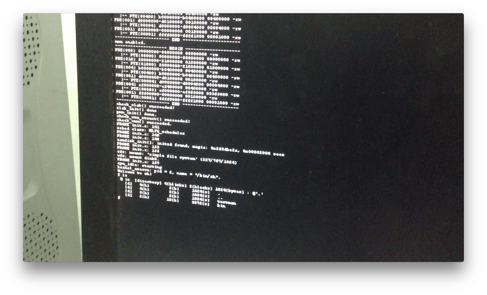

# uCore with GUI

计54 贾越凯 2015011335

2018 年 4 月 12 日

## 目标

在真实硬件环境中，让 uCore 支持轻量级图形界面的显示，并尽可能提高性能：

1. 将 Nuklear GUI 库移植到 uCore plus 并跑在 Raspberry PI 上，通过 HDMI 接口显示画面
2. 支持 VideoCore IV GPU 的 2D 硬件加速
3. 可能的扩展：
	+ 将 Nuklear GUI 库移植到 x86 等多种平台
	+ 支持 VideoCore IV GPU 的 3D 硬件加速

## 相关工作

### Goldfish 模拟器上 MiniGUI 的移植

仓库地址：
* https://github.com/chyh1990/ucore-arch-arm
* https://github.com/chyh1990/ucore-arm-userapp


主要贡献：
- 设计了 uCore Device Driver Envrionment，复用 Linux 驱动到 uCore plus 上。

不足：
- MiniGUI 仍然很复杂，依赖于 uClibc 等库，移植工作不完善。
- 没有在真实的设备上跑起来。

### Nuklear GUI 库

仓库地址：https://github.com/vurtun/nuklear


优势：
- 一种 Immediate Mode GUI，实现简单。
- 只包含一个头文件，依赖少。

未完成的工作：
- 后端需自行实现几个基本形状的绘制。

### Raspberry PI 上支持 HDMI 显示

项目 Wiki：http://os.cs.tsinghua.edu.cn/oscourse/OsTrain2012/Raspberry



主要贡献：
- 首次在 Raspberry PI 上运行了 uCore plus。

不足：
- 使用 Framebuffer 实现 HDMI 的输出，没有用到 Raspberry PI 上的 GPU 加速(VideoCore IV)。

## 设计方案

### Nuklear 的移植

- 先通过 Framebuffer 实现：

```c
fd = open("fb0:", O_RDWR);
ioctl(fd, FBIOGET_VSCREENINFO, &vinfo);
buf = mmap(0, vinfo->size, fd, 0);
memset(buf, 0x00, vinfo->size);
// ...
```

- Nuklear 自带的 [Demo](https://github.com/vurtun/nuklear/tree/master/demo/x11_rawfb) 中有基于 X11 Framebuffer 的后端实现，包括一些基本形状的绘制或填充，直接复用即可。

### VideoCore IV 硬件加速的支持
#### 关于 VideoCore IV

- 包含在 BCM2835 SoC 上，是 Raspberry Pi 的专用 GPU。
- 完全支持 OpenGL ES 2.0 和 OpenVG 1.1。
- 官方只开源了部分 [驱动程序](https://github.com/raspberrypi/userland) 和 [文档](https://docs.broadcom.com/docs/12358545)。
- 民间开源工作进展顺利，最新的 Mesa 3D 图形库和 Raspbian 系统已经可以使用硬件加速功能。

#### 实现思路

1. 尝试闭源的 [binary blob](https://github.com/raspberrypi/firmware) 是否可以直接使用。
2. 从 [Mesa 3D](https://github.com/mesa3d/mesa) 源码中寻找线索，可能需要移植 Mesa 3D。
3. 从 [Raspberry Linux](https://github.com/raspberrypi/linux) 源码中寻找线索，可能需要移植部分 Linux 图形子系统。

## 已完成的工作
- 2018 年 4 月 7 日，复现 MiniGUI。
- 2018 年 4 月 11 日，复现 uCore plus 在 Raspberry PI 运行并通过 HDMI 显示终端。

## 时间安排
- 第 7 周：完成了之前工作的复现。
- 第 8~9 周：熟悉 uCore plus，完成 Nuklear 的移植。
- 第 10~12 周：实现硬件加速。
- 第 13 周：测试、扩展。
