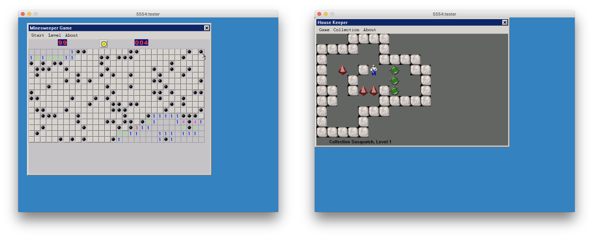
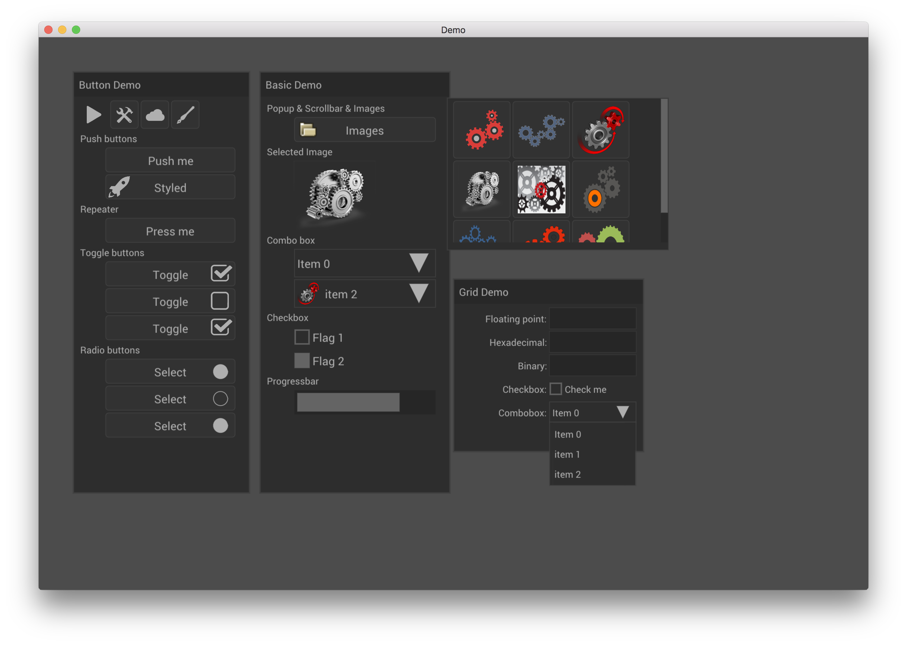
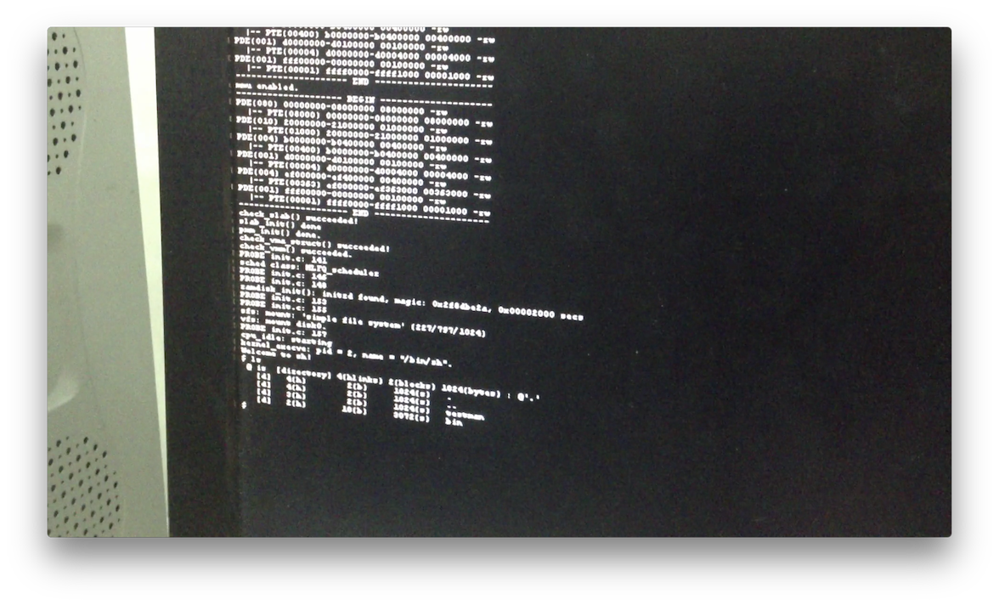

<!-- $theme: gaia -->
<!-- template: invert -->
<!-- Markdown Presentation Writer: https://yhatt.github.io/marp/ -->

# <span style="font-family:SimHei">uCore with GUI</span>

###### 计54 贾越凯 2015011335
###### 2018 年 4 月 12 日

---

## 目标概述

- 在真实硬件环境中，让 uCore 支持轻量级图形界面的显示，并尽可能提高性能

<!-- uCore 现在只是一个玩具，你不可能在自己的计算机上安装 ucore 并用它来工作。我的目标就是，是让它更好玩。比如，可以在嵌入式设备上运行 ucore，接上电视机，就可以用它来做机顶盒来放电影；接上触摸屏，就可以作为游戏机。所以，我的目标用一句话说，就是： -->

---

## 相关工作

<!-- footer: 相关工作 -->

---

### Goldfish 模拟器上 MiniGUI 的移植



---

### Goldfish 模拟器上 MiniGUI 的移植

- 设计了 uCore Device Driver Envrionment，复用 Linux 驱动到 uCore 上

---

### Goldfish 模拟器上 MiniGUI 的移植

- 设计了 uCore Device Driver Envrionment，复用 Linux 驱动到 uCore 上
- MiniGUI 仍然很复杂，依赖于 uClibc 等库，移植工作不完善

---

### Goldfish 模拟器上 MiniGUI 的移植

- 设计了 uCore Device Driver Envrionment，复用 Linux 驱动到 uCore 上
- MiniGUI 仍然很复杂，依赖于 uClibc 等库，移植工作不完善
- 没有在真实的设备上跑起来

---

### Nuklear GUI 库



---

### Nuklear GUI 库

- Immediate Mode GUI

---

### Nuklear GUI 库

- Immediate Mode GUI
- 单头文件

---

### Nuklear GUI 库

- Immediate Mode GUI
- 单头文件
- 后端需自行实现几个基本形状的绘制

---

### Raspberry PI 上支持 HDMI 显示



---

### Raspberry PI 上支持 HDMI 显示

- 首次在 Raspberry PI 上运行了 uCore plus

---

### Raspberry PI 上支持 HDMI 显示

- 首次在 Raspberry PI 上运行了 uCore plus
- 使用 Framebuffer 实现 HDMI 的输出，没有用到 Raspberry PI 上的 GPU 加速(VideoCore IV)

---

## 具体目标

<!-- footer: 具体目标 -->

---

## 具体目标

1. 将 Nuklear GUI 库移植到 uCore plus 并跑在 Raspberry PI 上，通过 HDMI 接口显示画面

---

## 具体目标

1. 将 Nuklear GUI 库移植到 uCore plus 并跑在 Raspberry PI 上，通过 HDMI 接口显示画面
2. 支持 VideoCore IV GPU 的 2D 硬件加速

<!-- footer: 具体目标 -->

---

## 具体目标

1. 将 Nuklear GUI 库移植到 uCore plus 并跑在 Raspberry PI 上，通过 HDMI 接口显示画面
2. 支持 VideoCore IV GPU 的 2D 硬件加速
3. 可能的扩展：
	+ 将 Nuklear GUI 库移植到 x86 等多种平台
	+ 支持 VideoCore IV GPU 的 3D 硬件加速

<!-- footer: 具体目标 -->

---

## 实验方案

<!-- footer: 实验方案 -->

---

### Nuklear 的移植
　

---

### Nuklear 的移植

- 先通过 Framebuffer 实现：

```c
fd = open("fb0:", O_RDWR);
ioctl(fd, FBIOGET_VSCREENINFO, &vinfo);
buf = mmap(0, vinfo->size, fd, 0);
memset(buf, 0x00, vinfo->size);
// ...
```
---

### Nuklear 的移植

- 先通过 Framebuffer 实现：

```c
fd = open("fb0:", O_RDWR);
ioctl(fd, FBIOGET_VSCREENINFO, &vinfo);
buf = mmap(0, vinfo->size, fd, 0);
memset(buf, 0x00, vinfo->size);
// ...
```
- 自带的 Demo 中有基于 X11 Framebuffer 的后端实现，包括一些基本形状的绘制或填充

---

### VideoCore IV 硬件加速的支持
#### 关于 VideoCore IV
　

---

### VideoCore IV 硬件加速的支持
#### 关于 VideoCore IV

- 包含在 BCM2835 SoC 上，是 Raspberry Pi 的专用 GPU

---

### VideoCore IV 硬件加速的支持
#### 关于 VideoCore IV

- 包含在 BCM2835 SoC 上，是 Raspberry Pi 的专用 GPU
- 完全支持 OpenGL ES 2.0 和 OpenVG 1.1

---

### VideoCore IV 硬件加速的支持
#### 关于 VideoCore IV

- 包含在 BCM2835 SoC 上，是 Raspberry Pi 的专用 GPU
- 完全支持 OpenGL ES 2.0 和 OpenVG 1.1
- 官方只开源了部分驱动程序和文档

---

### VideoCore IV 硬件加速的支持
#### 关于 VideoCore IV

- 包含在 BCM2835 SoC 上，是 Raspberry Pi 的专用 GPU
- 完全支持 OpenGL ES 2.0 和 OpenVG 1.1
- 官方只开源了部分驱动程序和文档
- 民间开源工作进展顺利，最新的 Mesa 3D 图形库和 Raspbian 系统已经可以使用硬件加速功能

---

### VideoCore IV 硬件加速的支持
#### 实现思路
　

---

### VideoCore IV 硬件加速的支持
#### 实现思路

1. 尝试闭源的 binary blob 是否可以直接使用

---

### VideoCore IV 硬件加速的支持
#### 实现思路

1. 尝试闭源的 binary blob 是否可以直接使用
2. 从 Mesa 3D 源码中寻找线索，可能需要移植 Mesa 3D

---

### VideoCore IV 硬件加速的支持
#### 实现思路

1. 尝试闭源的 binary blob 是否可以直接使用
2. 从 Mesa 3D 源码中寻找线索，可能需要移植 Mesa 3D
3. 从 Raspberry Linux 源码中寻找线索，可能需要移植部分 Linux 图形子系统

---

## 时间安排
- 第 7 周：完成了之前工作的复现
- 第 8~9 周：熟悉 uCore plus，完成 Nuklear 的移植
- 第 10~12 周：实现硬件加速
- 第 13 周：测试、扩展

<!-- footer: 时间安排 -->

---

# 谢谢大家

<!-- footer: -->
